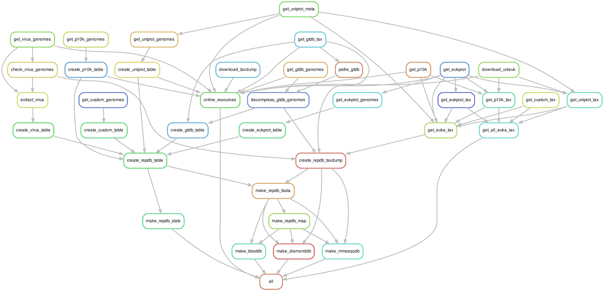
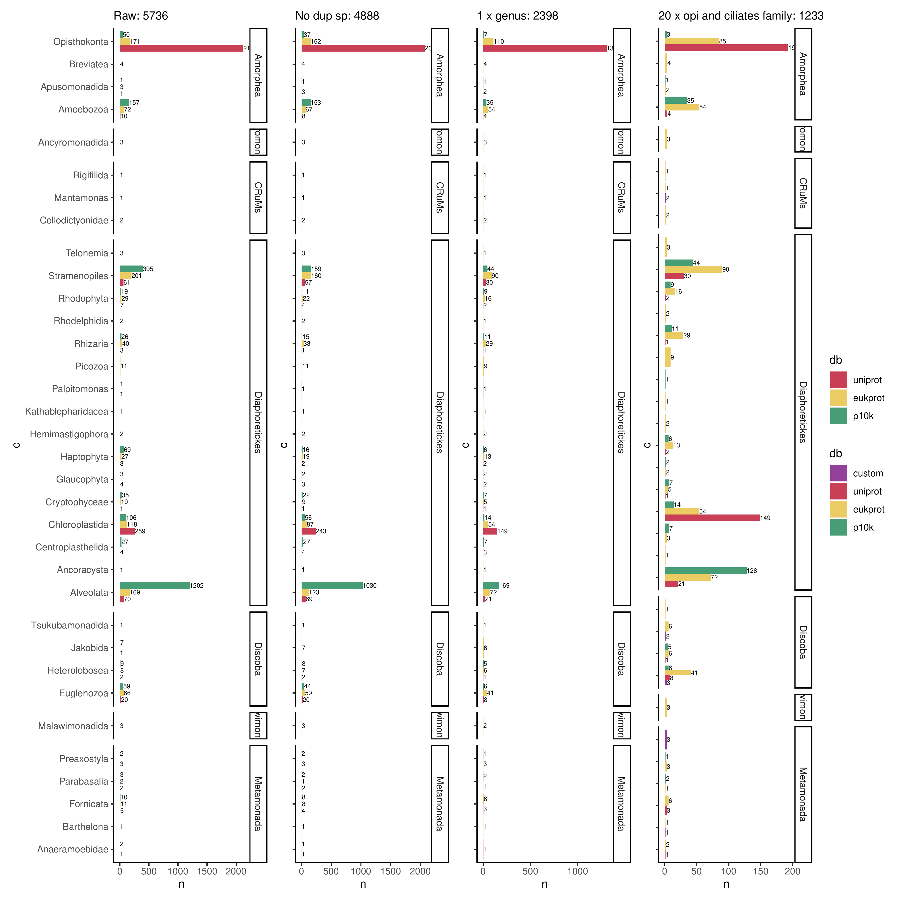

# BroadDB

## Taxonomic Composition

* **Eukaryotes:** represented by proteomes in [uniprot](https://www.uniprot.org/proteomes?query=*&facets=proteome_type%3A1%2Csuperkingdom%3AEukaryota), [EukProt](https://evocellbio.com/eukprot/), [P10K](https://ngdc.cncb.ac.cn/p10k/browse/genome) and custom genomes. All these proteomes will be annotated with unieuk taxonomy and selected to get the most taxonomically representative (`workflow/scripts/filter_tax.R`) by removing duplicated species, getting one species per genus and 20 per Opisthokonta and Ciliates family as they are overrepresented.
* **Prokaryotes:** Bacterial and Archeal genomes come from [GTDB](https://gtdb.ecogenomic.org/)
* **Viruses:** 
In this case we use all [NCBI RefSeq](https://www.ncbi.nlm.nih.gov/genome/viruses/) viral genomes. 

For Eukaryotes the taxonomic division can be in two ways:

* NCBI taxonomy
* UniEuk and Eukprot taxonomy where Class, Order and Family are represented by the supergroup division of eukprot (Supergroup_UniEuk, Taxogroup1_UniEuk, Taxogroup2_UniEuk). The script `workflow/scripts/get_tax.R` will try to look for each level in the NCBI taxonomy if there is a match with any UniEuk item. Then, will match the unieuk taxonomy to Eukprot supergroup division and get these 3 levels. Genus is inferred from species name and kingdom is Eukaryota by default.

## Build the database

You can check what the pipeline will do with: 

`snakemake --rulegraph | dot -Tpdf > resources/wf.pdf`

First of all you need to download some files from different public repositories, to do this you can run:

`snakemake -j4 -p --ri -k --until online_resources`

For p10k, viruses and uniprot genomes each one has to be downloaded, whereas for eukprot and gtdb you just need to download the big file once and then extract offline from that.

As in MN we only have internet in login nodes this only runs those rules that require some files to be downloaded with minimal parsing. Once it's done you can check the file of `results/meta/check_resources.txt` if all files look ok but they should if the pipeline did not fail.

After this you can do the heavy parsing and building the different dbs on a compute node with:

`snakemake -p --ri -k -j 48`

## Config

in `config/broaddb.yaml` you can specify:

* a file "clades_to_keep" where each line is a group where you'd like to include all avaiable genomes. All Custom genomes are kept by default.
* a file "genomes_to_exclude" where in each line you can specify a problematic id, useful if there are corrupted proteomes or things like this
* a tsv file "new_genomes" with these columns: ID,Species,Fasta,Lineage,Paper,Source,Note useful to retrieve new genomes not in various euka DBs 

## Output files

In `results/db` you will find the repdb fasta (`db/repdb.fa`), diamond (`repdb_diamond`) and mmseqs (`repdb_mmseqs`) databases, all taxonomically annotated. Blast (`repdb_blast`) is currently not done, uncomment the line in rule all if you want it. This is to avoid space and at the end if you run diamond ultra-sensitive its very similar to blast without needing two dbs.

In `results/meta` various metadata files including QC for every DB and various IDs files. 

In `results/proteomes` raw proteomes divided by DB. The parsed ones are directly piped into `db/repdb.fa`.

In `results/taxdump` both ncbi and repdb unieuk taxdump.

In `results/taxonomies` taxonomies files, for eukaryotes there are both ncbi and unieuk taxonomies. The file `all_eukaryotes.tsv` is interesting as they are all genomes, even if they are not included in repdb.

In `results/tmp` different files downloaded from internet that are big and could be deleted, the most important ones are gtdb proteins and EukProt fastas.

## Decontamination 

Ideally eukaryotic contaminants protein should be discarded. This could be dealt it in many ways:

In proteomes you could use a [BASTA](https://github.com/timkahlke/BASTA)-like approach to identify the LCA of proteins. The easiest would be to blast the euka agains the proka and filter the ones with very high identity.

For genomes you could use more sophisticated things such as [TIARA](https://github.com/ibe-uw/tiara), [metaQuast](https://quast.sourceforge.net/metaquast.html), follow the [GENERA pipeline](https://github.com/Lcornet/GENERA/wiki/09.-Genome-quality-assessment#genome-quality-assessment).

To assess the level of contamination you could run [CheckM2](https://github.com/chklovski/CheckM2) or [omark](https://github.com/DessimozLab/OMArk)

## Filtering Eukaryotes

Instead of adding all eukaryotic genomes there is a step (implemented in `workflow/scripts/filter_tax.R`) to select remove duplicated species, selecting one genome per genus and only considering max 20 genomes per Opisthokonta and Ciliates families (as they are clearly overrepresented). Selecting one genome per genus blindly may be too strict but from 5k genomes we get 2.4k suggesting there is a lot of redundancy. A possible better implementation would be to select one genome per genus only if the representative is complete>70% for example.

You can see the results of this filtering in `results/plots/euka_db.pdf`

## Diamond DB

After some updates on diamond the makedb with taxonomy names is not working (2.1.6 is working and 2.1.9 it is not). We can use prepdb from blast but you need the diamond with blast services compiled.

## TODO

- [ ] Add custom meta
- [ ] Merge all meta in a single meta
- [ ] Add Conda envs
- [ ] Once the maps are used gzip them and remove
- [ ] Once a new version you could run snakemake --force --until gtdb for example. Now they released new gtdb and test with this!
- [ ] Implement smarter rule for filtering eukaryotes.
- [ ] IMPORTANT MANAGE P10K EXCEPTIONS THAT ARE NOT IN UNIEUK! If no match you may keep the p10k as it should not cause conflicts??? Or better check in eukprot if some matches
- [ ] Decide if keeping taxid in protein name
- [ ] Add a script to input whatever list of ids and get the dbs, you could do another snakefile based on a config with db_name, taxids (either leaves or nodes) and one day fasta with other sequences (this would require to have a taxid map with the good taxonomy). 
- [x] Add seqkit stats rule
- [x] Check if taxonomy is alright
- [x] Protocol for updating the taxonomy according to the new added proteome
- [x] remove low complexity proteins
- [x] Right now to avoid adding 80k rules gtdb has to be downloaded with --until decompress_gtdb_genomes, not ideal but the fastest option
- [x] Add way to add custom DB
- [x] Decide if changing p10k id without dashes
- [x] Reduce broaddb redundancy
- [x] One day pass to ICTV taxonomy? I dont see many benefits for all the headaches, however if needed check this [repo](https://github.com/apcamargo/ictv-mmseqs2-protein-database)
- [x] Protocol to create a taxdump
- [x] Check the pr2 taxonomy
- [x] Add how to download uniprot proteomes
- [x] Add EukProt non opistho
- [x] Add P10K interesting
- [x] script parses the genome headers, assigning a new name for each protein, it also stores the original name related to the old name.

## Protocol for adding proteomes

In order to add a proteome you can modify the `euka_genomes.csv` table of [this repo](https://gitlab.bsc.es/gmutti/add_proteomes) and follow the instructions in the README.

## Dependencies

* tidyverse
* pandas
* csvtk
* taxonkit
* mmseqs
* blast
* diamond
* taxonkit

### Ideas

* Filter gtdb to reduce redundancy? Results were not satisfying.
* genome|gffs db?
