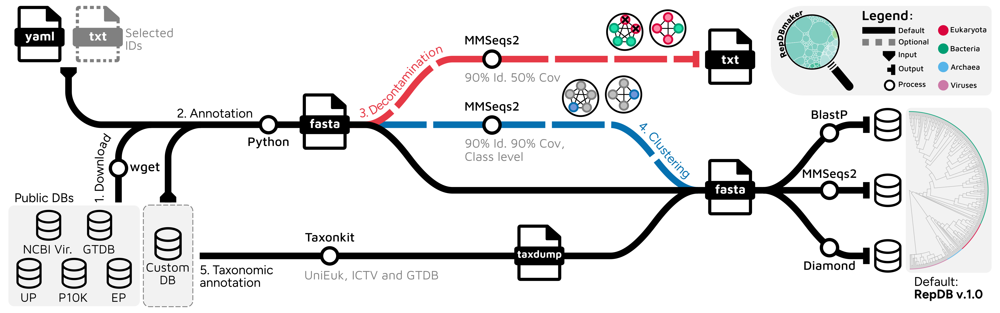

# RepDBmaker Pipeline

[](LICENSE)
[](https://snakemake.readthedocs.io)
[](https://hub.docker.com/repository/docker/gmuttiirb/repdbmaker/general)

A Snakemake workflow for building taxonomically annotated protein sequence
databases from public resources and custom genome collections.

<p align="center">
  
</p>

## Contents

- [Overview](#overview)
- [Installation](#installation)
- [Docker](#docker)
- [Quick start](#quick-start)
- [Reproducibility](#reproducibility)
- [Troubleshooting](#troubleshooting)
- [Documentation](#documentation)
- [Citation](#citation)

## Overview

RepDBmaker assembles protein sequence databases from multiple sources, annotates
them with taxonomy, and builds searchable indices for Diamond, MMseqs2 and BLAST.

It draws on:

- prokaryotes from [GTDB](https://gtdb.ecogenomic.org/)
- eukaryotes from [EukProt](https://evocellbio.com/eukprot/), [P10K](https://ngdc.cncb.ac.cn/p10k/), and [UniProt](https://www.uniprot.org/proteomes?query=%28taxonomy_id%3A2759%29)
- viruses from [NCBI Virus](https://www.ncbi.nlm.nih.gov/labs/virus/vssi/)
- your own genomes or transcriptomes, alongside the public sources

with optional [taxonomic clustering](docs/clustering.md) and
[contamination filtering](docs/decontamination.md) along the way.

## Installation

### Requirements

- [Snakemake](https://snakemake.readthedocs.io/en/stable/getting_started/installation.html) (v8.11.6)
- Conda or Miniconda
- Internet access for external downloads
- Sufficient disk space for genome and database files

Pick how the workflow schedules its jobs (local machine, SLURM, LSF, or a
site-specific profile) in [Choosing an executor](docs/executors.md).

If using `--sdm conda`, Snakemake will automatically create the following
environments from `workflow/envs/`:

- `workflow/envs/python.yaml`: Python, pandas, matplotlib, polars
- `workflow/envs/homology.yaml`: diamond, mmseqs2, blast
- `workflow/envs/utils.yaml`: taxonkit, csvtk, ncbi-datasets-cli, newick_utils, seqkit, jq, and standard CLI tools (wget, tar, unzip, gzip)
- `workflow/envs/R.yaml`: R and visualization/taxonomy packages
- `workflow/envs/krona.yaml`: Krona (interactive charts)

Create all of them up front, without running the pipeline:

```bash
snakemake --sdm conda --conda-create-envs-only
```

These `.yaml` specs are intentionally loose (minimum bounds only where a feature
requires it) so a fresh install resolves against current packages. To instead
reproduce the **exact** package builds used for the published RepDB v1.0, a pin
file (`workflow/envs/<name>.linux-64.pin.txt`) sits next to each `.yaml` and is
picked up automatically by `--sdm conda`, no extra flag needed.

## Docker

A Docker image is available at [Docker Hub](https://hub.docker.com/repository/docker/gmuttiirb/repdbmaker/general),
built from the pinned envs so it reproduces the RepDB v1.0 toolchain exactly,
without needing conda or Snakemake installed locally. From the repository root:

```bash
docker run --rm -t -v $(pwd):/app/data gmuttiirb/repdbmaker:v1.0 \
  snakemake --configfile config/repdb.yaml --cores <N> --directory /app/data \
  --sdm conda --conda-prefix /conda-envs
```

Both flags are required: `--sdm conda` turns on each rule's `conda:` env, and
`--conda-prefix /conda-envs` must be exactly this value to reuse the image's
pre-built environments instead of rebuilding them from scratch. Add `-n` to
preview the plan without running anything; `-t` just gets you Snakemake's
usual colored output.

For reproducible pulls, use the image's immutable digest instead of the
mutable `:v1.0` tag:

```bash
docker run --rm -t -v $(pwd):/app/data \
  gmuttiirb/repdbmaker@sha256:1c0d3f397ac79ff48f712448156d1a60eb751290fb7becb446c12a11d3a791bc \
  snakemake --configfile config/repdb.yaml --cores <N> --directory /app/data \
  --sdm conda --conda-prefix /conda-envs
```

## Quick start

The workflow is two phases that meet at the **universe**, the enriched table of
every available proteome (id, source, 7 ranks, completeness). Both phases read
the same config file; pick the phase with the target:

| command | produces |
|---------|----------|
| `snakemake sample` | **Pipeline 1 (curation)**: `results/universe/universe.tsv` + `results/universe/repdb.ids` + the taxonomy QC (no sequences fetched) |
| `snakemake build` | **Pipeline 2 (construction)**, the databases: `repdb` and, if configured, its clustered sibling `repdb_clustered` (+ decontamination, stats, `_meta.tsv`) |
| `snakemake` | both (`all`) |

`build` produces the universe first if needed, so it's self-contained; run
`sample` on its own to stop at the universe and review it before building.

To just inspect the available proteomes first:

```bash
snakemake -j 1 --until available_proteomes
# -> results/meta/available_proteomes.tsv, for picking a proteome subset
```

To build everything with the default config:

```bash
snakemake -j 14
```

For more, see [Example commands](docs/examples.md): a fast smoke test on a
tiny subset, building only a custom database, running on a scheduler,
reproducing a release, and more.

Producing an actual versioned release (freezing the universe, staging assets,
publishing to GitHub/Zenodo) is a longer process; see [docs/releasing.md](docs/releasing.md).

## Reproducibility

RepDBmaker supports reproducibility at three levels; pick the one your use case
needs.

| Level | What is fixed | How |
|-------|---------------|-----|
| **Parameter** | thresholds, which DBs, which subsets | the config file |
| **Composition** | *which* proteomes and their taxonomy | a pinned **universe** (below) |
| **Artifact** | exact tool builds and, ideally, the exact sequences | conda pin files + Docker digest + a Zenodo deposit of the FASTA |

### Pinned source snapshots

External sources drift, so pin the snapshots under `versions:` in
`config/repdb.yaml`:

- `gtdb`: a specific release (e.g. `release226`), never `latest`.
- `unieuk`: the exported UniEuk taxonomy version.
- `EukProt`: the EukProt version.
- `taxdump`: a dated NCBI taxdump archive (or `latest`).

For sources without stable versioned hosting (UniProt reference-proteome
release, RefSeq virus catalog, P10K), the **universe** below is what actually
freezes them, so record the retrieval date alongside your run too.

### Reproducing a release from a pinned universe

Because several sources are unversioned, re-running the full selection later
yields a *different* set of proteomes. Building from a frozen **universe**
instead of the live sources fixes that: taxonomy harmonization is skipped
entirely, and the selection re-runs deterministically on the pinned
composition.

```bash
snakemake build --configfile resources/releases/v1/config.yaml --sdm conda -j 8
```

`resources/releases/v1/config.yaml` is the self-contained build config for
that release, produced alongside its pinned `universe.tsv` when the release
was made. See [docs/releasing.md](docs/releasing.md) for how a release like
this gets produced, and where to download or publish its assets.

## Troubleshooting

Sometimes things can go wrong while downloading a proteome: rule `db_stats`
fails if any gzipped fasta is malformed, blocking the database fasta until
it's resolved.

```bash
cut -f1 results/dbs/<db>/genome_table.tsv | xargs -I {} sh -c 'gzip -t "{}" || echo "Failed: {}"'
```

Delete the problematic files and re-run the pipeline. If the problem
persists, the files may be broken at the source or the current downloading
script may be failing on them; we recommend excluding them and finding the
most suitable alternative.

## Documentation

Everything beyond this README lives under [`docs/`](docs/):

- [Example commands](docs/examples.md): a cookbook covering common tasks, from a fast smoke test to reproducing a release
- [Choosing an executor](docs/executors.md): local, SLURM, LSF, site profiles
- [Configuration](docs/configuration.md): full config reference plus eukaryote downsampling
- [Custom databases](docs/custom-databases.md): adding your own database or proteomes
- [Clustering](docs/clustering.md): the additive `cluster:` block, how it works, `repdb_clustered`
- [Decontamination](docs/decontamination.md): the cross-domain contamination filter
- [Outputs and quality control](docs/outputs-and-qc.md): where everything lands, and the QC reports
- [Utilities and benchmarking](docs/utilities-and-benchmarking.md): helper scripts, the NR/PhyloDB comparison
- [Building & releasing RepDB](docs/releasing.md): the full release process

## Citation

If you use RepDBmaker or RepDB, please cite:

> Mutti G. and Gabaldón T. Automated reconstruction of reproducible protein
> databases with RepDBmaker. *Protein Science* (2026).
> DOI: <add DOI on acceptance>

## License

See the [LICENSE](LICENSE) file for details.
