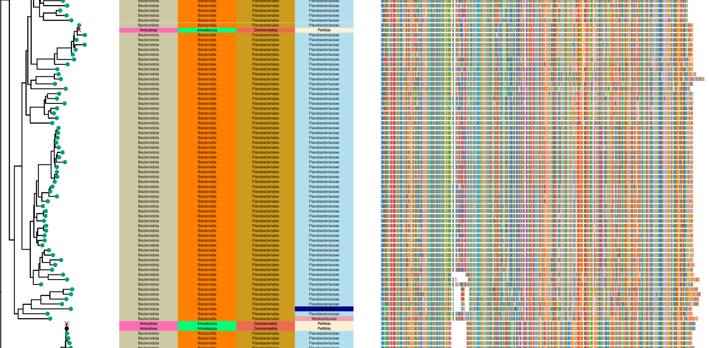
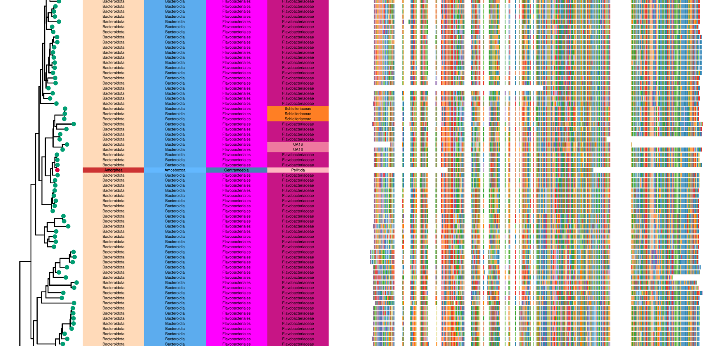

```{r setup, include=FALSE}
knitr::opts_chunk$set(echo = TRUE, cache = TRUE, warning = FALSE)
knitr::knit_hooks$set(crop = knitr::hook_pdfcrop)
knitr::opts_chunk$set(crop = TRUE)
```

```{r libs, message=FALSE, warning=FALSE}
suppressPackageStartupMessages(library(tidyverse))
library(patchwork)
theme_set(theme_classic())

color_db <- c("#c93f55", "#eacc62", "#469d76", "#924099")
names(color_db) <- c("UP", "EP", "PK", "CUS")

repdb_stats <- read_delim("results/meta/repdb_stats.tsv")

taxonomy <- read_delim("results/taxonomies/repdb.tsv", 
                       col_names =  c("mnemo", "k", "p", "c", "f", "o", "g", "s"))
```

# MMseqs pipeline

```{r read_clust}
clusters <- read_delim("results/contamination/mixed_cluster.tsv", 
           col_names = c("rep", "seq", "taxid", "tax"), delim = "\t")

euks <- clusters %>% 
  filter(grepl("Eukaryota;", tax)) %>% 
  separate(tax, c("k", "p", "c", "f", "o", "g", "s"), ";") %>% 
  separate(seq, c("taxid","mnemo","protein"), "_") %>% 
  mutate(db=gsub('[[:digit:]]+', '', mnemo),
         db=gsub("PK-.*", "PK", db))

single_euk <- euks %>% 
  group_by(rep) %>% 
  count() %>% 
  filter(n==1)

clusters_nonsingle <- filter(clusters, !rep %in% single_euk$rep)
rm(clusters)
gc()
```

On the 20th of May I thought that it would be possible to use [mmseqs](https://github.com/soedinglab/MMseqs2) to cluster all sequences in RepDB to detect mixed Eukaryotic and Prokaryotic/Virus clusters to detect possible contamination.

I tested with `--min-seq-id 0.85 -c 0.7 --cluster-mode 2 -e 0.001` to have a clustering of only very similar sequences (obvious contamination). The amazing thing is that with this approach you don't need to download anything and it runs in a couple of hours to cluster **330Mln** proteins!

After this, I get all those clusters that contain an eukaryote and anything from another kingdom (bac, arc, vir). These **"mixed" clusters contain `r nrow(euks)` eukaryotic sequences**.

Further, I checked the results and they are quite promising, I saw some overlap of the identified contaminants in tips in my Amoebas HGT tree and it clearly seems to work. It looked like we miss obvious contamination when the eukaryotes has a fragment of protein so that 0.7 coverage is not reached. This could be solved by using `--cov-mode 5` but I am afraid it would affect the result in a worse way.

# MMseqs results

We can exclude some of these clusters based on the *% of euka sequences and cluster size*. After filtering, my idea is to flag these sequences as contaminants, not excluding them from the DB but having a way to detect and exclude them in the downstream analysis.

```{r thresholds}
min_prop <- 0.5
max_size <- 10
```

I decided to use **`r min_prop` as minimum eukaryotic proportion and `r max_size` as maximum size for a cluster** to be deemed non contaminant. **All of the `r nrow(single_euk)` clusters with only one eukaryotic sequences are assumed as contamination**.

```{r n_euka, fig.width=10, fig.height=5}
df_euka_prop <- clusters_nonsingle %>% 
  separate(tax, c("k", "p", "c", "f", "o", "g", "s"), ";") %>% 
  group_by(rep) %>%
  mutate(n_clu=n(), n_sps=n_distinct(s)) %>% 
  group_by(rep, k, n_clu, n_sps) %>% 
  count() %>% 
  pivot_wider(names_from = k, values_from = n) %>% 
  mutate(euka_prop = Eukaryota/n_clu) %>% 
  ungroup()

txt_df <- df_euka_prop %>% 
  mutate(few_euks=euka_prop<min_prop, small_enough=n_clu<max_size) %>% 
  count(few_euks, small_enough) %>% 
  mutate(x=case_when(small_enough ~ max_size/2,
                     !small_enough ~ 100),
         y=case_when(few_euks ~ min_prop/2,
                     !few_euks ~ (min_prop+1)/2))

df_euka_prop %>% 
  ggplot(aes(n_clu, euka_prop)) + 
  stat_bin2d() + 
  # geom_point() +
  geom_text(aes(x,y,label=n), data = txt_df) +
  geom_vline(xintercept = max_size) +
  geom_hline(yintercept = min_prop) +
  scale_fill_viridis_c() + 
  scale_x_log10()

clusters_to_filter <- filter(df_euka_prop, euka_prop<min_prop | n_clu<max_size)$rep
clusters_single_euk <- single_euk$rep

contaminant_df <- euks %>%
  mutate(contaminant = rep %in% c(clusters_to_filter, clusters_single_euk)) %>% 
  filter(contaminant) %>% 
  mutate(protein=paste(taxid,mnemo,protein, sep = "_"))
# pull(protein)
```

Therefore, we find that all `r txt_df[!txt_df$few_euks & !txt_df$small_enough,]$n` clusters with more than `r max_size` sequences and more then `r min_prop` eukaryotes are not contamination and flag all the other **`r nrow(contaminant_df)`** sequences.

We also can observe which DB and family has the most contaminated proteomes. This clustering could also be useful to detect particular pairs of euka-proka (cocultures etc) maybe in order to think of a better way to decontaminate specific proteomes.

```{r plot_prop_cont, fig.width=13, fig.height=10}
num_seqs_fam <- repdb_stats %>% 
  left_join(select(taxonomy, mnemo, f), by=c("file"="mnemo")) %>% 
  group_by(f) %>% 
  summarise(num_seqs=sum(num_seqs))

plot_abs_cont <- ggplot(contaminant_df, aes(y=fct_rev(fct_infreq(f)), fill=db)) + 
  geom_bar() + 
  labs(y="family") + 
  scale_x_continuous(expand = expansion(add = c(0, 0))) +
  scale_fill_manual(values = color_db)

plot_prop_cont <- contaminant_df %>% 
  group_by(f, db) %>% 
  count() %>% 
  left_join(num_seqs_fam, by="f") %>% 
  mutate(prop_contaminated=n/num_seqs,
         f=factor(f, levels=levels(fct_rev(fct_infreq(euks$f))))) %>% 
  ggplot(aes(prop_contaminated, f,
             fill=db)) + 
  geom_bar(stat = "identity") + 
  labs(y="") + 
  scale_x_continuous(expand = expansion(add = c(0, 0))) +
  scale_fill_manual(values = color_db)

(plot_abs_cont|plot_prop_cont) + plot_layout(guides = "collect")
```

# Amoebozoa examples

<center>
.
</center>
<br>

This is an example of an hgt gene tree, you could see that there are two clear eukaryotic contaminations. Also, in this case a seed sequence is actually a contaminant.

<center>
.
</center>
<br>


This is an example where the contamination is not detected because the eukaryote has a only a fragment.

# Tiara and blast based approaches

[Tiara](https://github.com/ibe-uw/tiara) would be interesting to use but I see three main issues: the need of genomes, the deep learning based approach and the speed.

The first issue is important because RepDB is already big, if in the process we need to download hundreds of genomes and process them it's going to scale up considerably. Nevertheless Tiara is quite fast. Also, genome quality and fragmentation is quite a problem in protists and they do not reccomend to run tiara in contigs shorter than 3Kb. 

Further, I would not necesarrily trust results of a deep learning method in weird eukaryotes, although I should look into the training set used for the model.

If we decide to use Tiara a possible approach would be to identify non-euka contigs and remove all the proteins from these contigs. A problem with this is that it is not necessarily easy to map proteins to genomes, even though with miniprot this should not be such a big issue.

Finally, a lot of these proteomes are from transcriptomes and would not be viable for this. One possible approach would be to blast in prokaryotes but it would be definitely very computational intensive.

Having said this, runnning Tiara on those proteomes with kind of good genomes would be feasible as it's fast.

# Conclusion

I think this is a very good, fast and relatively accurate way to identify obvious contamination. One thing I could do is explore how many contaminants we find by playing with the mmseqs parameters but already with this choice I think it's good enough.

# TODOs

* should i try `--cov-mode 5` or play with other mmseqs parameters?
* Can you find any particular association between euka-proka?
